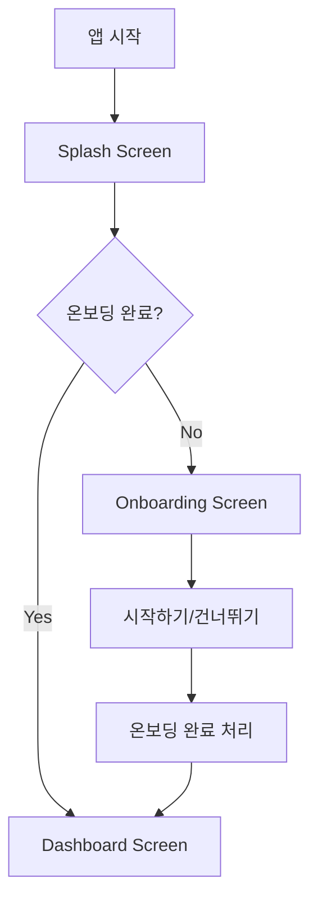

# 📱 DevRoutine 앱 매뉴얼

## 🎯 개요
DevRoutine은 개발자를 위한 루틴 관리 Flutter 앱입니다. Clean Architecture 패턴과 Riverpod을 사용한 상태 관리를 통해 구성되었습니다.

## 🚀 앱 실행 순서

### 1. **초기 설정 과정**
```
앱 시작 → Hive 초기화 → 알림 서비스 초기화 → 메인 앱 실행
```

### 2. **화면 전환 플로우**


#### 📚 **첫 사용자 경로**
1. **Splash Screen** (2초)
   - DevRoutine 로고 표시
   - 로딩 애니메이션
   - 초기화 완료 대기

2. **Onboarding Screen**
   - **페이지 1**: "3일만 해보세요!" - 습관 형성 소개
   - **페이지 2**: "오늘 할 일 확인" - 체크 기능 소개
   - **페이지 3**: "지금 시작하기" - 루틴 생성 안내
   - 완료 후 `SharedPreferences`에 상태 저장

3. **Dashboard Screen**
   - 메인 화면으로 이동

#### ✅ **기존 사용자 경로**
1. **Splash Screen** (2초)
2. **Dashboard Screen** (바로 이동)

## 🏗️ 프로젝트 구조

### 📁 폴더 구조
```
lib/
├── core/                           # 핵심 공통 기능
│   ├── constants/                  # 상수 정의
│   │   ├── app_colors.dart         # 색상 상수
│   │   ├── app_fonts.dart          # 폰트 상수
│   │   └── app_sizes.dart          # 크기 상수
│   ├── providers/                  # 전역 프로바이더
│   │   ├── theme_provider.dart     # 테마 관리
│   │   └── onboarding_provider.dart # 온보딩 상태 관리
│   ├── routing/                    # 라우팅 설정
│   │   ├── app_router.dart         # 라우트 정의
│   │   └── app_router.gr.dart      # 자동 생성 라우트
│   ├── services/                   # 서비스 레이어
│   │   ├── ad_service.dart         # 광고 서비스
│   │   └── notification_service.dart # 알림 서비스
│   ├── theme/                      # 테마 설정
│   │   ├── app_theme.dart          # 앱 테마
│   │   └── typography.dart         # 타이포그래피
│   ├── utils/                      # 유틸리티
│   │   └── debug_logger.dart       # 디버그 로거
│   └── widgets/                    # 공통 위젯
│       └── banner_ad_widget.dart   # 배너 광고 위젯
├── features/                       # 기능별 모듈
│   ├── onboarding/                 # 온보딩 기능
│   │   └── onboarding_screen.dart
│   ├── routine/                    # 루틴 관리 기능
│   │   ├── data/                   # 데이터 레이어
│   │   │   ├── datasources/        # 데이터 소스
│   │   │   ├── models/             # 데이터 모델
│   │   │   └── repositories/       # 리포지토리 구현
│   │   ├── domain/                 # 도메인 레이어
│   │   │   ├── entities/           # 엔티티
│   │   │   ├── models/             # 도메인 모델
│   │   │   ├── repositories/       # 리포지토리 인터페이스
│   │   │   └── usecases/           # 유스케이스
│   │   └── presentation/           # 프레젠테이션 레이어
│   │       ├── providers/          # 상태 관리
│   │       ├── screens/            # 화면
│   │       ├── utils/              # 유틸리티
│   │       └── widgets/            # 위젯
│   └── splash/                     # 스플래시 화면
│       └── splash_screen.dart
└── main.dart                       # 앱 진입점
```

## ⚙️ 초기화 과정

### 1. **main() 함수 실행 순서**
```dart
void main() async {
  // 1. Flutter 바인딩 초기화
  WidgetsFlutterBinding.ensureInitialized();
  
  // 2. 로케일 초기화 (한국어)
  await initializeDateFormatting('ko_KR', '');
  
  // 3. Hive 초기화
  await Hive.initFlutter();
  
  // 4. Hive Adapter 등록
  Hive.registerAdapter(RoutineModelAdapter());
  Hive.registerAdapter(PriorityAdapter());
  Hive.registerAdapter(RoutineTypeAdapter());
  
  // 5. 데이터베이스 박스 열기
  await Hive.openBox<RoutineModel>('routines');
  
  // 6. 알림 서비스 초기화
  await NotificationService().initialize();
  
  // 7. 앱 실행
  runApp(ProviderScope(child: DevRoutineApp()));
}
```

### 2. **주요 초기화 구성 요소**

#### 🗄️ **Hive (로컬 데이터베이스)**
- **목적**: 루틴 데이터의 로컬 저장
- **TypeId 구성**:
  - `0`: RoutineModel
  - `1`: Priority (우선순위)
  - `2`: RoutineType (루틴 타입)

#### 🔔 **알림 서비스**
- **플랫폼별 설정**:
  - **Android**: `android.permission.POST_NOTIFICATIONS` 권한
  - **iOS**: `Info.plist`에 알림 권한 설정
- **기능**: 루틴 알림, 일정 알림

#### 🌍 **국제화**
- **기본 로케일**: 한국어 (`ko_KR`)
- **날짜 형식**: 한국 표준

## 🔧 개발 환경 설정

### 1. **필수 종속성**
```yaml
dependencies:
  flutter:
    sdk: flutter
  
  # 상태 관리
  flutter_riverpod: ^2.4.9
  riverpod_annotation: ^2.3.3
  
  # 라우팅
  auto_route: ^7.9.2
  
  # 로컬 저장소
  hive: ^2.2.3
  hive_flutter: ^1.1.0
  shared_preferences: ^2.2.2
  
  # UI/UX
  introduction_screen: ^3.1.12
  google_fonts: ^6.1.0
  
  # 알림
  flutter_local_notifications: ^16.3.2
  
  # 날짜/시간
  intl: ^0.19.0
  
  # 광고
  google_mobile_ads: ^4.0.0
  
  # 상태 모델링
  freezed_annotation: ^2.4.1
```

### 2. **개발 도구**
```yaml
dev_dependencies:
  # 코드 생성
  build_runner: ^2.4.7
  auto_route_generator: ^7.3.2
  hive_generator: ^2.0.1
  riverpod_generator: ^2.3.9
  freezed: ^2.4.7
  json_annotation: ^4.8.1
  json_serializable: ^6.7.1
  
  # 린팅
  flutter_lints: ^3.0.0
```

### 3. **코드 생성 명령어**
```bash
# 모든 코드 생성
flutter packages pub run build_runner build

# Watch 모드로 실행 (파일 변경 시 자동 생성)
flutter packages pub run build_runner watch

# 기존 생성 파일 삭제 후 재생성
flutter packages pub run build_runner build --delete-conflicting-outputs
```

## 🎨 아키텍처 패턴

### 1. **Clean Architecture**
- **Presentation Layer**: UI 컴포넌트, 상태 관리
- **Domain Layer**: 비즈니스 로직, 엔티티, 유스케이스
- **Data Layer**: 데이터 소스, 리포지토리 구현

### 2. **상태 관리 (Riverpod)**
- **Provider 타입**:
  - `StateNotifierProvider`: 복잡한 상태 관리
  - `FutureProvider`: 비동기 데이터
  - `Provider`: 단순 값 제공

### 3. **라우팅 (AutoRoute)**
- **설정 파일**: `lib/core/routing/app_router.dart`
- **자동 생성**: `app_router.gr.dart`
- **네비게이션**: `context.router.navigate()`

## 🚦 디버깅 및 로깅

### 디버그 로그 확인
앱 실행 중 콘솔에서 다음과 같은 로그를 확인할 수 있습니다:

```
🏗️ [SPLASH] SplashScreen 생성자 호출됨
🎬 [SPLASH] SplashScreen initState 시작
🔄 [ONBOARDING] OnboardingNotifier 초기화 시작
📱 [ONBOARDING] SharedPreferences에서 온보딩 상태 로드 시작
💾 [ONBOARDING] 저장된 상태: false
✅ [ONBOARDING] 상태 로드 완료 - 현재 상태: false
🚀 [SPLASH] 네비게이션 시작
🎯 [SPLASH] 첫 사용자 → 온보딩 화면으로 이동
```

## 📝 주요 특징

### 1. **성능 최적화**
- `const` 생성자 사용으로 불필요한 리빌드 방지
- 얕은 위젯 트리 구조로 렌더링 성능 향상
- Riverpod의 효율적인 상태 관리

### 2. **사용자 경험**
- 부드러운 애니메이션 전환
- 직관적인 온보딩 프로세스
- 반응형 UI 디자인

### 3. **확장성**
- 모듈화된 기능 구조
- Clean Architecture를 통한 유지보수성
- 테스트 가능한 코드 구조

## 🔍 문제 해결

### 1. **Hive TypeId 충돌**
```dart
// 기존 박스 삭제 후 재생성
if (await Hive.boxExists('routines')) {
  await Hive.deleteBoxFromDisk('routines');
}
```

### 2. **온보딩 상태 초기화 문제**
```dart
// 강제 초기화로 해결
WidgetsBinding.instance.addPostFrameCallback((_) {
  ref.read(onboardingProvider.notifier);
});
```

### 3. **알림 권한 문제**
- **Android**: `android/app/src/main/AndroidManifest.xml`에 권한 추가
- **iOS**: `ios/Runner/Info.plist`에 알림 설정 추가

---

📧 **문의사항이나 버그 리포트**는 프로젝트 이슈 탭에 등록해 주세요. 